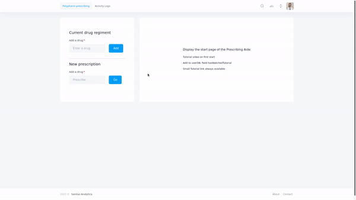

### Hi there 👋

- Doing fullstack dev + AI/Stats at [Sanitas Analytica](https://www.sanitasanalytica.com/)
- [Bonseyes](https://www.bonseyes.com/) validated AI talent 
- Previously researched ML in pharmacogenomics @ Ruđer Bošković Institute - Machine Learning Lab
- Studied chemical engineering

### Current stack
- Pytorch, Angular, Flask, SQLAlchemy, Postgres

### Projects
#### Polypharm Solutions MVP

- Visit [Sanitas Analytica](https://www.sanitasanalytica.com/) for current developments

#### [Drug Attrition Oracle](https://github.com/dionizijefa/Drug-Attrition-Oracle)
- Models for predicting wether a drug will be withdrawn from the market. Part of the AI4EU-MODRAI challenge - AI4EU
*This project has received funding from the European Union's Horizon 2020 research and innovation programme under grant agreement 825619.
