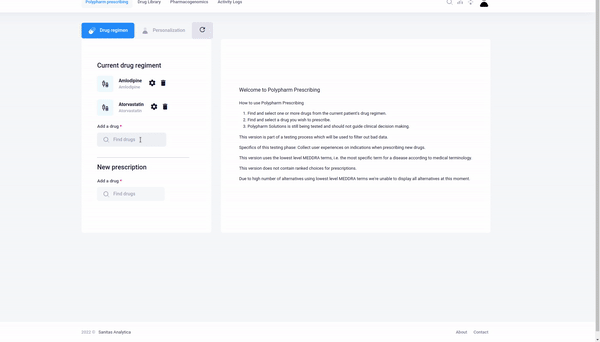
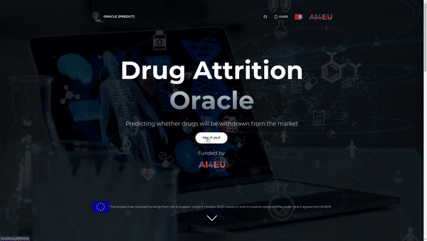
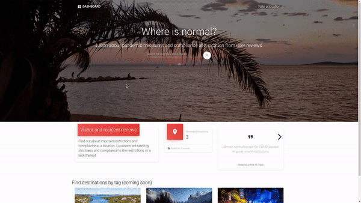
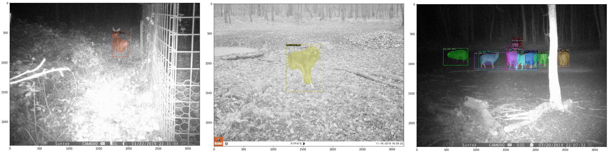

### Hi there 👋

- Doing fullstack dev + AI/Stats at [Sanitas Analytica](https://www.sanitasanalytica.com/)
- [Bonseyes](https://www.bonseyes.com/) validated AI talent 
- Previously researched ML in pharmacogenomics at Ruđer Bošković Institute - Machine Learning Lab
- Studied chemical engineering

### Current stack
- Pytorch, Angular, Flask, SQLAlchemy, Postgres

### Projects
#### [Polypharm Solutions](https://www.sanitasanalytica.com/polypharm-solutions)
- 
- Visit [Sanitas Analytica](https://www.sanitasanalytica.com/) for current developments

#### [Drug Attrition Oracle](https://github.com/dionizijefa/Drug-Attrition-Oracle)
- Models for predicting wether a drug will be withdrawn from the market. Part of the AI4EU-MODRAI challenge.
- Visit at [dao.zel.irb.hr](dao.zel.irb.hr)
- This project has received funding from the European Union's Horizon 2020 research and innovation programme under grant agreement 825619.
- 

#### [Travel restrictions](https://www.whereisnormal.com/#/landing)
- User ratings for pandemic restrictions at reviewed locations
- 

#### Trail cam segmentation
- Developed a quantized instance segmentation model using trail cam images (deer, roe deer, wild boar, fox)
- Using manually labeled proprietary, both night and daytime data
- 
